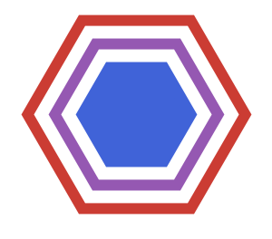

# dggrid-julia 

ddgrid-julia provides bindings for the Discrete Global Grid System [DGGRID](https://github.com/sahrk/DGGRID) written in C++ for directly accessing the functions and types in the Julia programming language.

Discrete Global Grid Systems (DGGS) tessellate the surface of the earth with hierarchical cells of equal area, minimizing distortion and loading time of large geospatial datasets, which is crucial in spatial statistics and building Machine Learning models.

## Get Started

This project is not intended to use directly.
Please look at the Julia package [DGGS.jl](https://github.com/danlooo/DGGS.jl) instead.
However, this library package can be installed in Julia with the following commands:

```Julia
using Pkg
Pkg.add("dggrid_jll")
```

## Development

This project is using [wrapit](https://github.com/grasph/wrapit), [CxxWrap.jl](https://github.com/JuliaInterop/CxxWrap.jl) and [libcxxwrap-Julia](https://github.com/JuliaInterop/libcxxwrap-Julia) to automatically generate Julia bindings for the C++ code of [DGGRID](https://github.com/sahrk/DGGRID).
It serves as a basis for the Julia package DGGGS.jl.
[BinaryBuilder](https://github.com/JuliaPackaging/BinaryBuilder.jl) is used to deploy the binaries as a Julia package.
Instead of accessing system shell calls, this wrapper approach allows to access the C++ functions directly within Julia using pointers.
This project is different from [DGGRID7_jll](https://github.com/JuliaBinaryWrappers/DGGRID7_jll.jl) which just provides the binaries of [DGGRID](https://github.com/sahrk/DGGRID) without the Julia bindings.
Earthly is used for building and testing the software.
Its [`Earthfile`](Earthfile) provides an overview about the architecture of this project.
